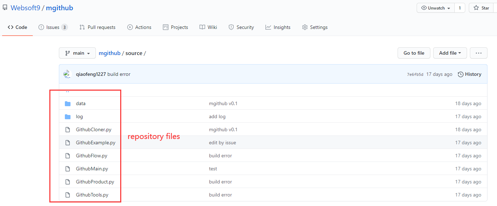

# Github自动化构建项目

## 需求

Github 上有些企业组织，维护的开源项目可能会有几十个甚至上百个，这些项目不断迭代过程中可能产生一致性**批量**维护的需求。 

主要包括两类：

* **Repository files**

即项目包含的所有文件，通常通过 git 进行多人协作开发和管理。



例如：

1. 批量备份： 备份组织下所有项目
2. 批量替换： 指定可访问的的源文件或文件夹，对目标文件或文件夹进行替换，可能存在强制执行的情况
3. 批量复制： 指定可访问的的源文件或文件夹，复制到指定位置
4. 批量移动： 移动文件或文件夹到本项目的其他目录
5. 批量修改： 根据指定的命令，对单个文件进行修改（替换、删除或追加）
6. 批量删除： 删除指定文件或文件夹
7. 批量模板实例化： 根据项目的技术元数据，将指定模板进行实例化操作
8. 批量改名： 对文件或文件夹进行改名

* **Repository Settings**

即项目在 Github 界面的设置属性，通常可以通过界面或 Github API 进行修改


例如：

1. 批量管理分支： 创建、删除、设置默认、更名
2. 批量修改 Key： 
3. 用户管理： 权限设置、从项目 Member 中移除等

以上操作也可以抽象成一个功能，通过附加任务指令的方式进行操作。


## 详细需求与设计

### CLI 设计

项目采用命令行式的用户体验，主要参数和功能如下：

```
Usage: mgithub [options] COMMAND  [options]

Options:
  -h, --help                show this help message and exit
  -v, --version             show the version
  -l, --logs                show the logs
  -url                      set your git URL, the default value is https://github.com/websoft9
  --skip-get-repositories   skip get repositories
  --skip-broken             skip command error and continue next repository
  -f, --force               do not prompt before overwriting

Commands:
  configure
  repocache
  backup
  move

  > 更多参考下面的**业务方法**章节


```

### 安装

由于这是一个CLI程序，需提供上传到pip库，用户通过pip 安装后即可使用的安装方案。

### 元数据

以文件的形式存放系统配置信息

meta/data.txt

```
url: https://github.com
...
```


### 方法

本项目方法分为系统方法和业务方法两种类型。

#### 系统方法

系统方法是为业务方法（mgithub command）提供底层的系统处理功能，此类方法不面向用户，只供程序内部调用：

主要包括：

**read_metadata**

功能：
场景：

```
read_metadata(item_name)
{
   read item_name from meta/data.txt;
   return item_value;
}
```

**modify_metadata**

功能：
场景：

```
modify_metadata( item_name, item_value){
   modify item_name from meta/data.txt using item_value;
}
```

**output_log**

功能：通过 history 命令输出历史 mgithub 最近2条操作记录以及 log/mgithub.log 最新10条记录  
场景：运行命令时，若有缓存文件，需通过此方法输出信息便于用户做出判断  

output_log()
{
  history | grep mgithub
  cat /log/mgithub.log
}

**get_list**

功能：获取组织下的所有 repository 名称
场景：每次运行命令，都需要启动此方法获取组织下的所有项目信息

lists format: 
websoft9/ansible-owncloud
websoft9/ansible-wordpress

get_list(){
    get lists from URL
    return lists;
}

**git_clone**

功能： git clone 项目

git_clone(repository_name){
    get clone from URL/repository_name
}

**push_repo**

功能：提交修改并 Push 到远程，然后返回状态（status= failed | ok）
场景：所有对 repository files 进行的操作，最后需 Push 到远程仓库  

```
push_repo (comment)
{
  try:
    git add
    git commit "comment"
    git push

  catch exception:
    git push
  }

  return status;

}
```

**print_log**

功能：以固定的格式写日志文件：log/mgithub.log  
场景：command 正常执行完成或发生错误之后需调用此方法

mgithub.log file format: 
Date and time     | organization/repository name  | command | status      
-------------------------------------------------------------
2021-01-25 14:36 | organization/ansible-wordpress | copy    |   failed     
2021-01-25 14:39 | organization/ansible-nextcloud | delete  |   ok        
2021-01-25 14:39 | organization/ansible-erpnext   | format  |   ok       

```
print_log (repository,command,status){

    }
``` 

**delete_line**

功能：删除指定文件中包含“key”的一行数据
场景：command 每完成一个 repository 之后，引用此方法删除 repositories_cache 文件对应的 repository

delete_line (key, file){

}


#### 业务方法

业务方法即 `mgithub [options] COMMAND  [options]` 中的 COMMAND，是面向用户的业务和功能操作。

**configure**

功能：提示用户输入初始化所需的 组织URL 等信息

configure{

  input URL?  等待输入；
  ...
  写入 meta/data.txt
}

**repocache**

功能：Generate the repositories cache

repocache{

  get_list();
  write to data/organization_repositories.txt
}

**backup**

功能：backup all repositories to Path

backup(path){
    if path not null, backup all repositories to Path/organization_20200122
    else
       backup all repositories in the pwd/organization_20200122
}


**copy**

功能：copy files or folder from source to destination


copy(source_path, destination_path){
    git_clone();
    ...
    push_repo();
    print_log();
}


**move**

功能：Move files or folder from source to destination, source and destination must in the same repository


move(source_path, destination_path){
    git_clone();
    ...
    push_repo();
    print_log();
}

**delete**

功能：Delete files or folder of repository

delete(path){

    git_clone();
    ...
    push_repo();
    print_log();
}

**rename**

功能：rename the file or folder

rename(path, new_name){

    git_clone();
    ...
    push_repo();
    print_log();
}

**replace**

功能：根据指定的命令行，对单个文件进行内容替换，如果没有提供 new_content，则等同于删除 old_content 操作

replace(file_path, old_content, new_content){

    git_clone();
    ...
    push_repo();
    print_log();
}

**lineinsert**

功能：根据指定的命令行，向指定文件的指定位置下方插入新的字段（支持多行）

lineinsert(file_path, line, content){

    git_clone();
    ...
    push_repo();
    print_log();
}

**jinja2format**

功能：基于jinja2，对模板进行实例化

format(template, variable){

    git_clone();
    ...
    push_repo();
    print_log();
}

**githubcli**

功能：执行 Github 官方的 [CLI](https://cli.github.com/manual/) 命令 

githubcli(clistring){

    ...
    print_log();
}