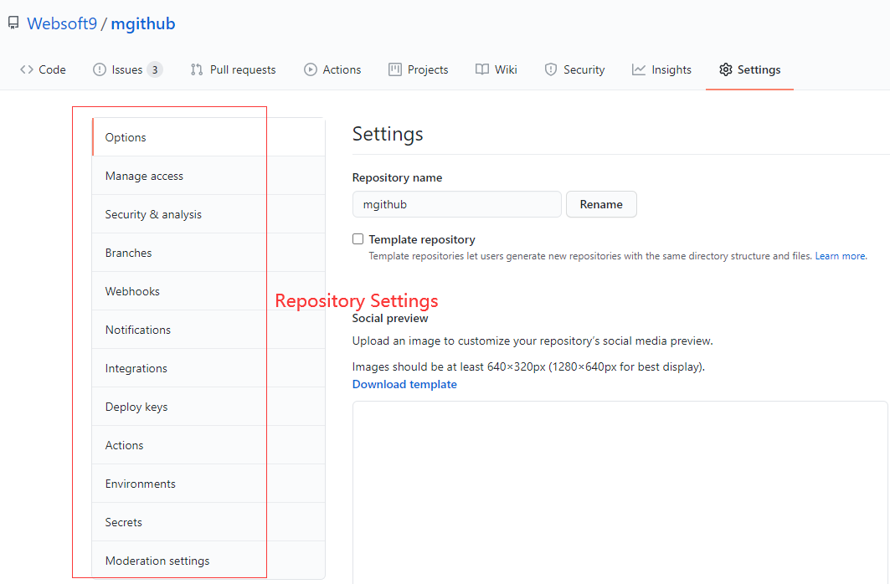

# Github自动化构建项目

## 需求

Github 上有些企业组织，维护的开源项目可能会有几十个甚至上百个，这些项目不断迭代过程中可能产生一致性**批量**维护的需求。 

主要包括两类：

* **Repository files**

即项目包含的所有文件，通常通过 git 进行多人协作开发和管理。


例如：

1. 批量备份： 备份组织下所有项目
2. 批量替换： 指定可访问的的源文件或文件夹，对目标文件或文件夹进行替换，可能存在强制执行的情况
3. 批量复制： 指定可访问的的源文件或文件夹，复制到指定位置
4. 批量移动： 移动文件或文件夹到本项目的其他目录
5. 批量修改： 根据指定的命令或脚本，对单个文件进行修改
6. 批量删除： 删除指定文件或文件夹
7. 批量模板实例化： 根据项目的技术元数据，将指定模板进行实例化操作

* **Repository Settings**

即项目在 Github 界面的设置属性，通常可以通过界面或 Github API 进行修改



例如：

1. 批量管理分支： 创建、删除、设置默认、更名
2. 批量修改 Key： 
3. 用户管理： 权限设置、从项目 Member 中移除等

以上操作也可以抽象成一个功能，通过附加任务指令的方式进行操作。


## 设计

### CLI 设计

```
-o organization


```

### 详细

自动化处理的内容随着发展会不断追加和变更，因此我们这个自动化构建脚本也会不断更新。现阶段而言，我们主要在如下几个方面有自动化构建需求：


### 方法抽象

#### 处理项目本体

* createdev
* copy(source, des)
* delete(filepath | folderpath)
* backup
* format(filepath)
* modify(filepath, cmdstring)

#### 处理 Github repository 元数据

设置权限，更新密码，增加用户


### 自动化构建readme文档（中文）

首先建立一个通用的readme模板，差异化地方用变量名称替换。
